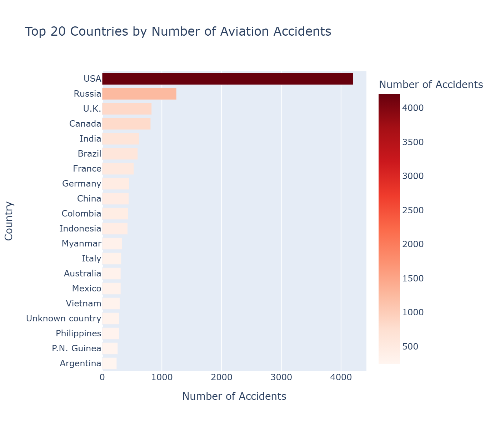
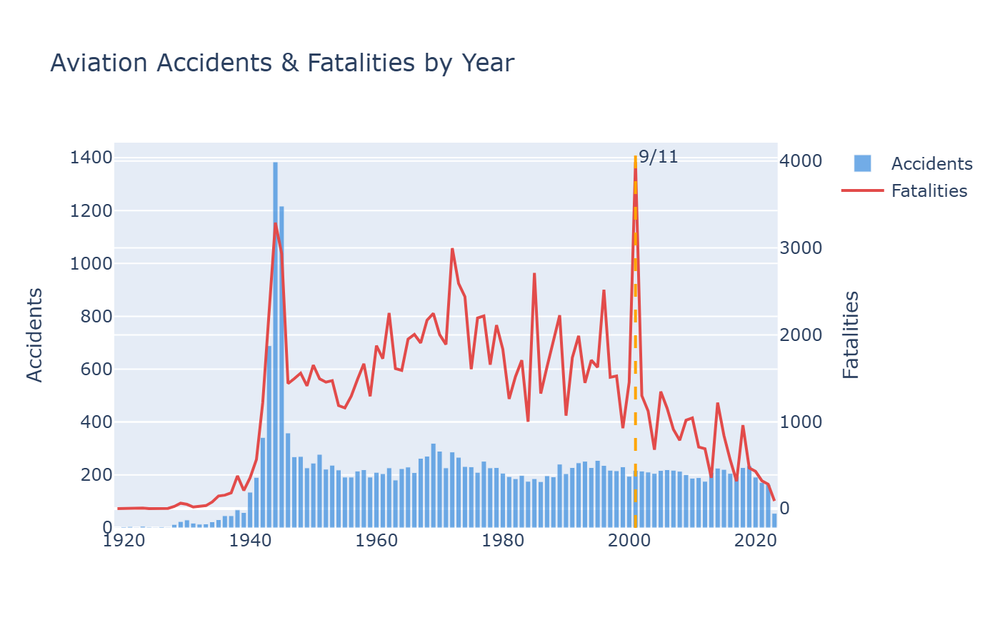
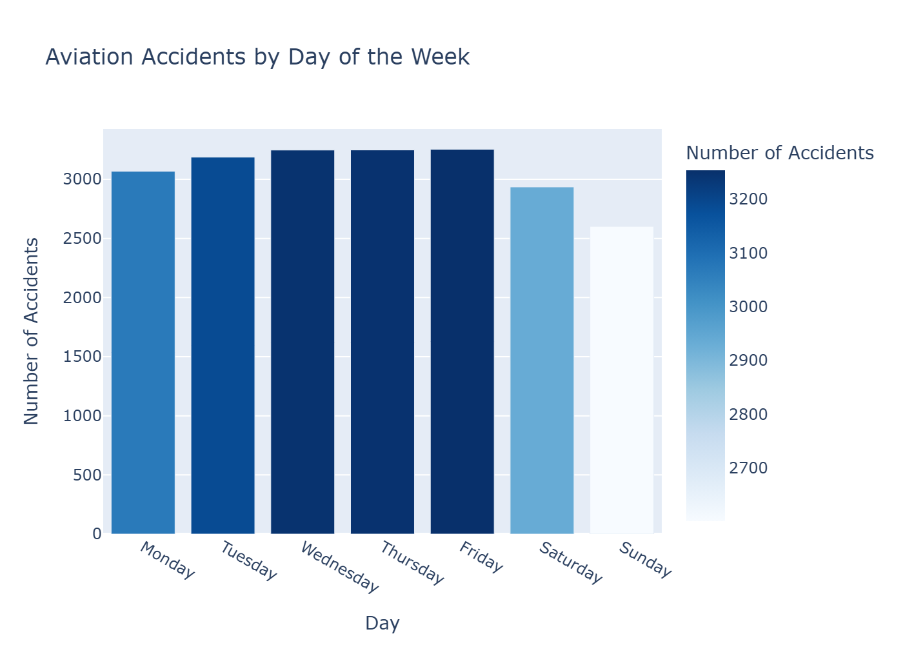
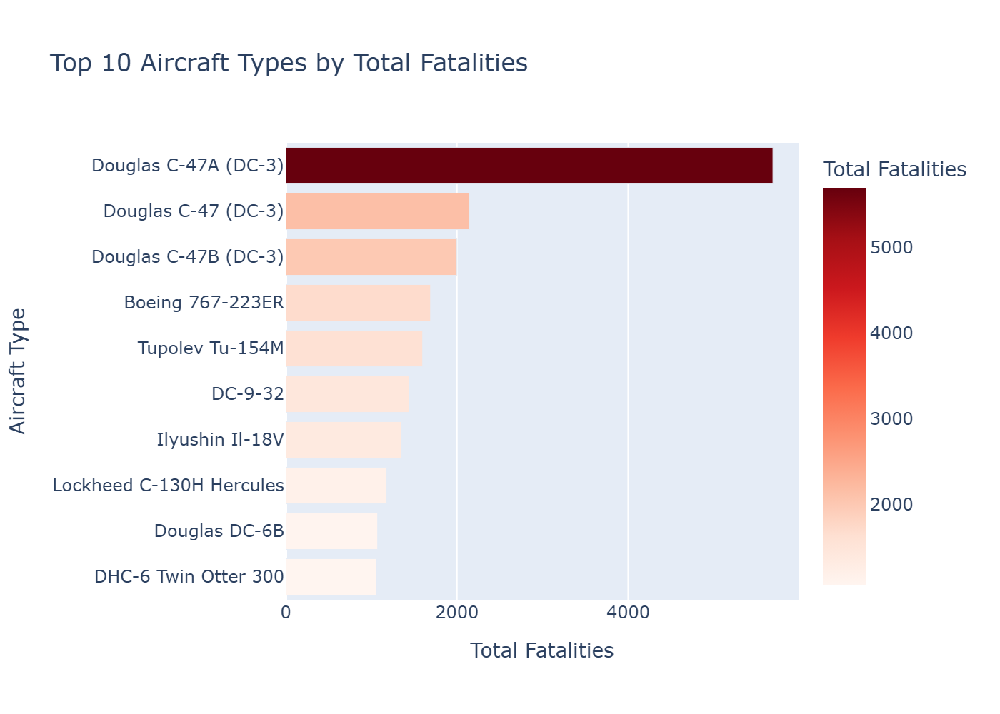
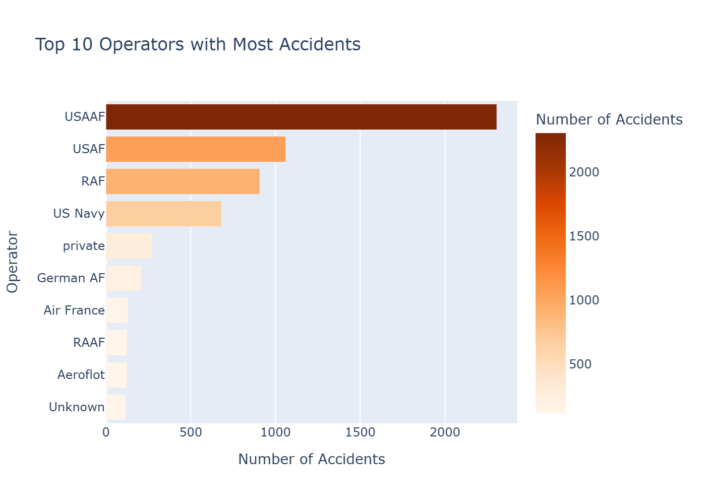
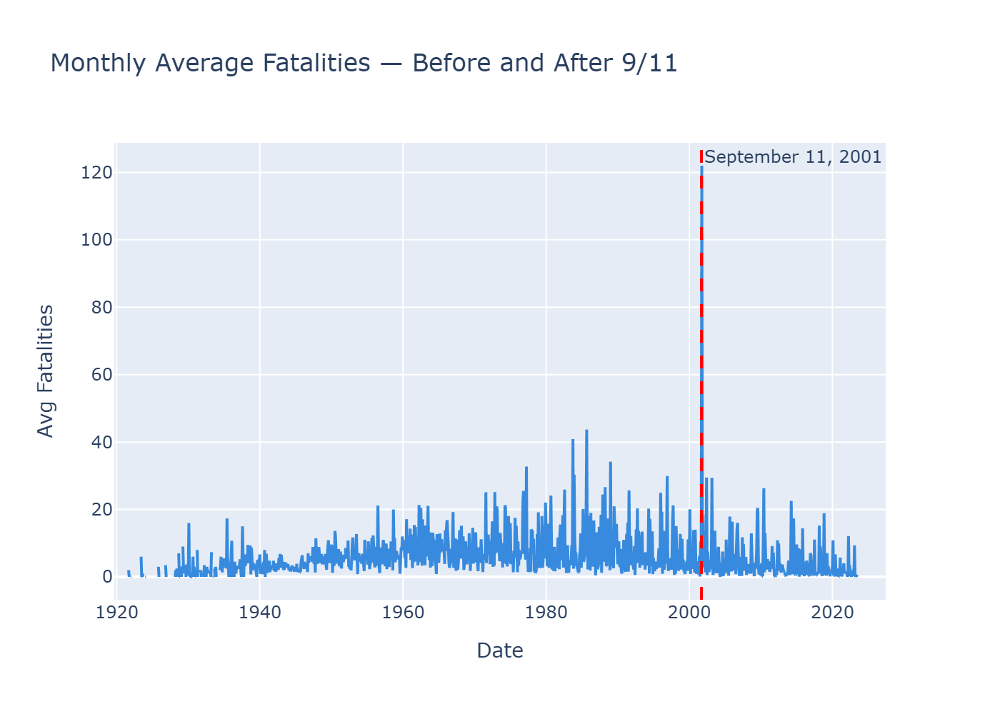
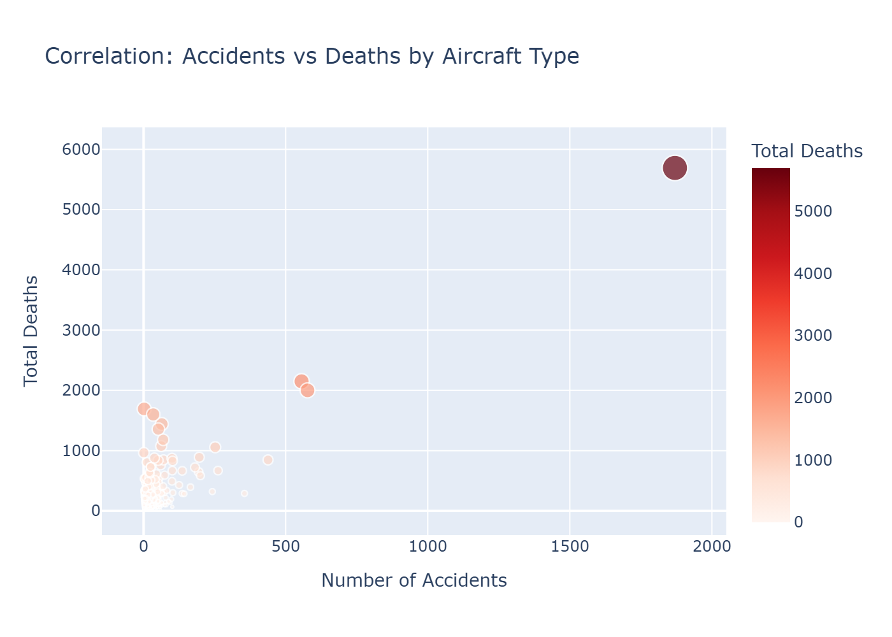
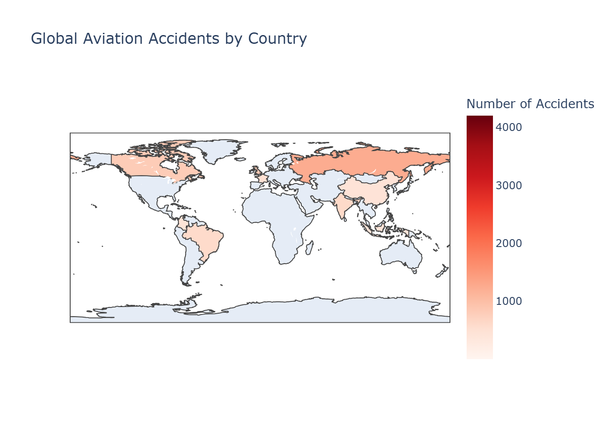

# ✈️ Aviation Disasters Analysis

> An end-to-end data analysis of global aviation accidents — uncovering patterns in fatalities, high-risk operators, and the measurable impact of 9/11 on aviation safety.

   

---

## The Problem

Aviation accidents generate vast amounts of historical data — but raw data alone doesn't answer the questions that matter: **Which countries are most dangerous? Which aircraft types cause the most deaths? Did 9/11 change aviation safety forever?**

This project transforms a complex, messy dataset into clear, actionable insights through rigorous data cleaning and multi-angle analysis.

---

## Key Questions Answered

1. Which countries have the highest number of aviation accidents?
2. How has the number of accidents evolved over time?
3. Which days of the week are most dangerous for aviation?
4. Which aircraft types are responsible for the most fatalities?
5. Which operators have the worst safety records?
6. **Did September 11, 2001 change average fatality rates?**
7. Is there a correlation between number of accidents and total deaths by aircraft type?

---

## Key Findings

| Insight | Finding |
|---------|---------|
| Most accidents | United States leads globally |
| Peak accident period | Mid-20th century — declining after 1970s |
| Deadliest aircraft type | Large commercial jets |
| Most dangerous operator | Military operators (Cold War era) |
| Post-9/11 impact | Measurable drop in average daily fatalities |
| Safest day to fly | Weekend flights show lower accident rates |

---

## Visualizations

### Top 20 Countries by Number of Accidents


### Accidents & Fatalities by Year


### Accidents by Day of the Week


### Top 10 Aircraft Types by Fatalities


### Top 10 Operators with Most Accidents


### The 9/11 Effect — Monthly Average Fatalities


### Correlation: Accidents vs Deaths by Aircraft Type


### Global Aviation Accidents Map


---

## Highlight: The 9/11 Effect

One of the most compelling findings of this analysis is the **measurable impact of September 11, 2001** on aviation safety metrics. By splitting the dataset pre and post 9/11, we can quantify how global aviation security reforms changed fatality rates — with a clear and measurable drop in average daily fatalities after that date.

---

## Data Cleaning Highlights

This dataset required significant preprocessing before analysis:

- **Date parsing:** thousands of records had `"date unk."` — replaced with `NaT` and recovered from a secondary `year` column where possible
- **Fatalities correction:** values stored as strings with arithmetic expressions — evaluated safely with `eval()`
- **Country name normalization:** mapped 15+ inconsistent country names to match geographic data
- **Duplicate and null removal:** dropped rows with missing registration, location, and operator

---

## Tech Stack

| Tool | Purpose |
|------|---------|
| Python | Core language |
| Pandas | Data cleaning & analysis |
| NumPy | Numerical operations |
| Plotly | Interactive visualizations |
| Matplotlib / Seaborn | Static charts |

---

## Project Structure

```
aviation-disasters-analysis/
├── notebooks/
│   └── aviation_analysis_pro.ipynb
├── outputs/
│   ├── accidents_by_country.png
│   ├── accidents_by_year.png
│   ├── accidents_by_day.png
│   ├── aircraft_fatalities.png
│   ├── accidents_by_operator.png
│   ├── sept11_impact.png
│   ├── correlation_scatter.png
│   └── world_map.png
└── README.md
```

---

## How to Run

```bash
pip install pandas numpy matplotlib seaborn plotly kaleido jupyter

jupyter notebook
```

Open `notebooks/aviation_analysis_pro.ipynb` and run all cells.

---

## About

This project demonstrates end-to-end data analysis skills: messy real-world data cleaning, temporal analysis, interactive visualization with Plotly, and business storytelling — applied to a globally significant dataset.

**Open to freelance data analysis projects** — feel free to reach out!
